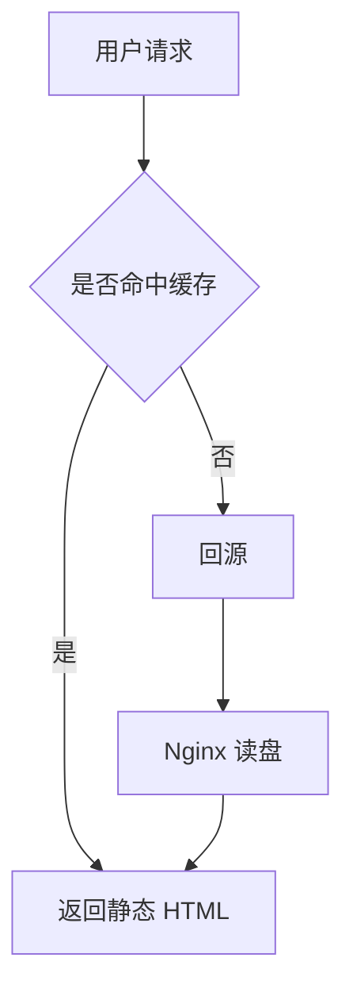

# 魔鬼测试文章

这篇文章故意塞满了所有难处理的元素。它同时服务于两个验收：

- **渲染验收**（`docs/04 §10` 的 R1/R2）：渲染出的 HTML 必须正确处理每一种元素
- **翻译验收**（`docs/06 §9` 的 T1~T22）：翻译后每一处受保护内容必须**逐字节不变**

## T1 · 代码块（含中文注释）

代码块内的一切都不得翻译，**包括中文注释**：

```go
package main

import "fmt"

// 这行中文注释翻译后必须原样保留
func main() {
	// 计算斐波那契数列
	a, b := 0, 1
	for i := 0; i < 10; i++ {
		fmt.Println(a) // 输出当前值
		a, b = b, a+b
	}
}
```

## T2 · 行内代码

执行 `docker compose up -d` 即可启动全部服务，配置文件是 `/etc/nginx/nginx.conf`。

变量名 `maxRetries` 和函数 `handleRequest()` 都不应被翻译。

## T3 · URL

访问 `https://example.com/a?b=c&d=中文&e=1` 查看详情，或者直接点 [这个链接](https://example.com/path/to/page?query=值)。

裸链接：https://api.deepseek.com/v1/chat/completions

## T4 · IP 地址

服务器内网地址是 `192.168.1.100:8080`，网关 10.0.0.1，IPv6 是 `2001:0db8:85a3::8a2e:0370:7334`。

## T5 · 文件路径

配置在 `/etc/systemd/system/blog.service`，日志在 `/var/log/nginx/access.log`。

Windows 下是 `C:\Program Files\Blog\config.yaml`。

## T6 · 数学公式

行内公式：质能方程 $E = mc^2$ 说明了质量与能量的关系。

块级公式：

$$
\sum_{i=1}^{n} i = \frac{n(n+1)}{2}
$$

复杂一点的：

$$
\frac{\partial u}{\partial t} = h^2 \left( \frac{\partial^2 u}{\partial x^2} + \frac{\partial^2 u}{\partial y^2} \right)
$$

## T7 · Mermaid 图表



## T8 · 原始 HTML

<details>
<summary>点击展开详细说明</summary>

这段文字在 HTML 标签内部，**应该被翻译**，但 `<details>` 和 `<summary>` 标签本身不能动。

</details>

行内 HTML：这是<sup>上标</sup>和<sub>下标</sub>，还有一个<br>换行。

## T9 · 链接

[点击这里](https://example.com) 查看文档，或访问 [官方仓库](https://github.com/example/repo)。

带标题的链接：[悬停看看](https://example.com "这是标题文字")

引用式链接：[参考文档][ref1] 和 [另一个][ref2]。

[ref1]: https://example.com/docs
[ref2]: https://example.com/api

## T10 · 图片


相对路径引用：

## T11 · 表格

| 组件 | 语言 | 内存占用 | 说明 |
|---|---|---:|:---:|
| 后端 | Go | 80 MB | 单二进制 |
| 渲染器 | Node.js | 60 MB | 仅发布时使用 |
| 数据库 | SQLite | 5 MB | 仅存运行状态 |

对齐方式（`---:` 右对齐、`:---:` 居中）必须保留。

## T12 · 任务列表

- [x] 已完成的任务
- [ ] 未完成的任务
- [x] 另一个已完成项
  - [ ] 嵌套的子任务

## T13 · 脚注

Markdown 是唯一的正文源格式[^1]，HTML 只是派生产物[^note]。

[^1]: 这是第一个脚注的内容，包含一个 `代码片段` 和一个 [链接](https://example.com)。
[^note]: 命名脚注同样需要正确处理。

## T14 · 嵌套列表

1. 第一层有序项
   - 第二层无序项
     - 第三层无序项
       1. 第四层有序项
   - 另一个第二层
2. 第二个第一层
   1. 嵌套有序
   2. 再来一个

## T15 · 引用块内含代码块

> 这是一段引用文字，下面是引用内的代码块：
>
> ```bash
> curl -fsSL https://example.com/install.sh | sh
> ```
>
> 引用结束。

嵌套引用：

> 第一层引用
>
> > 第二层引用
> >
> > > 第三层引用

## T16 · 行内格式

这是 **加粗文字**，这是 *斜体文字*，这是 ~~删除线~~，这是 ***粗斜体***。

组合：**加粗中的 `代码`** 和 *斜体中的 [链接](https://example.com)*。

## T17 · 标题层级

深度序列必须完全一致：`# ## ### ## ####`

### 三级标题

#### 四级标题

##### 五级标题

###### 六级标题

## T18 · 特殊字符与实体

HTML 实体：&amp; &lt; &gt; &quot; &nbsp;

需要转义的字符：\* \_ \# \[ \] \( \) \\ \`

Emoji：:rocket: 和真实 emoji 🚀 ✅ ⚠️

## T19 · 中文排版细节

中文与 English 混排时的空格处理。数字 123 和中文之间。

标点符号：这是逗号，这是句号。这是「引号」和『书名号』，还有——破折号……以及省略号。

繁简差异测试：这里的「软件」在繁体中应译为「軟體」，「网络」应为「網路」，「打印」应为「列印」。

## T20 · 模板变量与 Shell 语法

模板占位符 `{{ .Title }}` 和 `${VARIABLE}` 不应被翻译。

```bash
export BLOG_AI_API_KEY="${DEEPSEEK_API_KEY}"
echo "当前目录：$(pwd)"
```

## T21 · 邮箱与域名

联系方式 admin@example.com，域名 blog.example.com 和 api.deepseek.com。

## T22 · 超长段落（分批测试）

这一段是为了测试分段器的批次划分逻辑而故意写长的。分段器需要按字符预算把段落分批发送给模型，每批不超过 `config.ai.segmentBudget` 指定的字符数（默认 2500）。当单个段落超过预算时，它应该单独成批而不是被拆开——因为拆开会破坏语义连贯性，导致翻译质量下降。如果一个段落超过 8000 字符，系统应该记录警告但仍然发送，并在模型返回被截断时标记该文章翻译失败，提示用户手动拆分段落。这段文字同时包含了 `行内代码`、[链接](https://example.com)、**加粗**和 IP 地址 192.168.1.1，用于验证行内占位符在长段落中依然能被正确提取和还原。占位符使用 `⟦P1⟧` 这样的数学白括号记号，选它的理由是几乎不会出现在自然语言中，模型也不会把它当作 Markdown 语法或者试图"修正"它。

---

## 分隔线之后

上面是一条主题分隔线（`---`），它不能被误判为 Front Matter 的结束标记。

最后一行正文。
