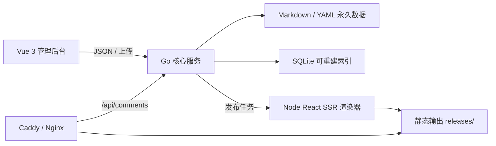

# MutiBlog 技术架构

## 1. 架构决定

MutiBlog 采用“一个常驻 Go 服务 + 一个按需 Node 渲染器 + 一个容器”的结构。



### 1.1 常驻 Go 服务

负责：

- 初始化、单管理员认证、会话和 CSRF；
- 文件仓库的读写、锁、校验和原子替换；
- 内容、媒体、评论、主题、备份和翻译任务 API；
- SQLite 索引、外部文件变化检测与重建；
- 任务调度、事件日志和健康检查；
- 提供嵌入式管理后台静态资源；
- 调用按需渲染器并原子切换公开版本。

选择 Go 的原因是单二进制、低常驻内存、文件和并发任务控制成熟。

### 1.2 Vue 3 管理后台

负责 Halo 风格控制台。技术基线：

- Vue 3 + TypeScript + Vite；
- Vue Router + Pinia + TanStack Vue Query；
- `@halo-dev/components`（MIT）作为公共 UI 原语；
- CodeMirror 6 作为 Markdown 编辑器；
- `vue-i18n` 加载后台语言包。

后台不持有永久真相，只通过 API 工作；当前只有明确保存会写入文件仓库。是否增加浏览器离线草稿、自动保存及其恢复策略仍是待确认产品问题。

### 1.3 Node React SSR 渲染器

Node 不是常驻 Web 服务。Go 在发布、预览和主题安装校验时启动渲染 CLI：

```text
mutiblog-render --input <snapshot.json> --theme <dir> --output <staging-dir>
```

渲染器负责：

- 加载受支持版本的主题 manifest 与服务端 bundle；
- React SSR；
- Markdown 渲染与代码高亮；
- 生成多语言页面、回退跳转、搜索索引、RSS、sitemap 与 robots；
- 公开框架字典按“当前语言 → 源语言 → 内置英文安全底座”解析，缺失文案不会改变内容 URL 的回退规则；
- 产出构建报告和内容哈希。

渲染进程设有超时、内存限制、Node 文件系统权限、输出目录边界和结构校验；第三方主题仍按管理员主动安装的代码处理，不宣称完整安全沙箱。全部正式构建与主题预览共享一个串行发布门禁；活动主题包替换、设置变更和切换会在修改前取得同一门禁，直到渲染成功提交或完整回滚，后台翻译发布不能观察到中间主题状态。

## 2. 运行目录

默认工作目录为 `/var/lib/mutiblog`，可用 `MUTIBLOG_DATA_DIR` 覆盖。

```text
/var/lib/mutiblog/
├── config/
│   ├── site.yaml
│   ├── locales.yaml
│   ├── admin.yaml
│   └── secrets.yaml          # 0600，备份排除
├── content/
│   ├── posts/
│   ├── pages/
│   ├── taxonomies/
│   ├── menus/
│   ├── links/
│   └── dictionaries/
├── comments/
├── media/
│   ├── originals/
│   └── metadata/
├── themes/
│   ├── installed/
│   └── settings/
├── revisions/
├── releases/                # 文章/页面不可变公开快照与原子指针
│   ├── posts/
│   └── pages/
├── state/
│   ├── index.sqlite          # 可删除
│   ├── tasks/
│   └── audit/
├── generated/                # 可删除
│   ├── staging/
│   ├── previews/
│   └── releases/
└── backups/
```

`content`、`comments`、`media/originals`、非秘密 `config`、主题包与设置、`revisions`、`releases` 是永久数据。`state/index.sqlite` 与整个 `generated` 可安全删除并重建。

## 3. 写入与一致性

每次永久写入遵循：

1. 在同目录创建临时文件；
2. 写入并 `fsync`；
3. 校验 YAML/Markdown schema；
4. 原子 `rename` 替换目标；
5. `fsync` 父目录；
6. 更新 SQLite 投影；
7. 投影失败时记录重建标记，永久文件仍为权威。

同一实体使用进程内 keyed mutex；所有修改带 `revision`/ETag，过期客户端写入返回 `409`。外部文件修改由 watcher 和启动时全量扫描发现。

## 4. 发布协议

发布采用不可变 release 与原子指针：

1. 明确发布时先将编辑 head 写入 `releases/<kind>/<id>/snapshots`，再原子更新实体公开指针；
2. 构建器冻结所有实体公开 release 和其他公开资源，写出单次任务输入快照；
3. 渲染到 `generated/staging/<job-id>`；
4. 渲染器校验输入 schema、永久 ID、主题协议和输出边界，服务端再检查必须产物、文件数量、总体积与符号链接；
5. 移到 `generated/releases/<release-id>`；
6. 原子更新 `generated/current` 符号链接；
7. 保留最近若干 release 供快速回滚，并始终额外保护刚被替换的 current 一代，直到后续发布。

备份恢复在交换永久数据前先捕获 `generated/current` 的相对 release 目标，并把“已捕获”状态与目标一并写入恢复事务日志。候选数据虽需先通过静态构建门禁，但只要恢复事务随后回滚（包括进程中断或提交标记落盘失败），公开 symlink 也会以原子替换恢复到旧 release，避免旧数据与候选 HTML 混用；持久提交标记存在时则保留已经验证的候选 release。

恢复事务还会在交换前暂存本机 `secrets.yaml` 与 `initialized` 的字节值；候选提交前必须确认二者未变化、SQLite 投影为 ready、活动主题运行时可加载，并且 `generated/current/build-report.json` 与本次构建报告一致。健康条件最多轮询五次，失败不提交恢复。

正常运行时 Go 服务只从 `generated/current` 读取现成文件并处理真实 302、ETag、Range 与语言协商，不解析 Markdown 或查询内容数据库。根路径协商只读取当前 release 的 `build-report.json` 和 `redirects.json`，因此尚未成功构建的语言配置不会泄漏到公开路由。应用进程不可用时，Caddy 从只读数据卷直接提供最后一个静态 release；动态评论与后台不可用，但已发布正文继续访问。

主题预览复用同一快照和受限渲染器，但产物进入 `generated/previews/<random-id>`，永不更新 `generated/current`。预览记录放在可丢弃的 `state/previews`，30 分钟过期且最多保留 10 份；固定同级预览子域用独立 HttpOnly Cookie 选择 release，主站后台会话不会发送到该域。

## 5. 安全边界

- 密码使用 Argon2id；会话 token 随机生成，仅保存哈希；Cookie 为 HttpOnly、SameSite=Lax，HTTPS 下 Secure。登录的凭据校验与会话签发和密码修改共享同一互斥区，密码修改写入新哈希并清空会话后，旧密码请求不能迟到签发新会话。
- 后台变更请求校验会话绑定的 CSRF token；会话 Cookie 使用 SameSite=Lax。
- 图片上传按内容探测得到的 MIME、允许扩展和大小校验，文件名不参与磁盘路径；更严格的完整图片解码校验尚未宣称完成。
- ZIP 安装拒绝绝对路径、`..`、符号链接逃逸和解压炸弹。
- API Key 仅存 `config/secrets.yaml`，目录 0700、文件 0600；API 和日志始终遮罩。
- 初始化、登录、退出、密码修改、备份恢复、主题生命周期和 Provider 变更写入固定字段的 `state/audit/security.jsonl`；事件结构不接受任意详情，客户端地址仅保留摘要，避免密码、API Key 或原始地址进入审计。
- 备份使用白名单选取，不以黑名单排除秘密。
- 渲染器只能写入任务 staging 目录，并限制执行时间和输出体积。

## 6. 可观测与恢复

- `/health/live`：进程存活；
- `/health/ready`：永久目录当前可写；索引状态由管理接口单独报告；
- `/api/v1/admin/system/status`：初始化、版本、发布器和索引摘要；
- 结构化 JSON 日志，敏感字段统一脱敏；
- 每个后台任务写入可恢复的 YAML 任务记录；
- 启动时清理孤儿 staging、恢复可重试任务、扫描文件与索引差异。

## 7. 不采用的方案

- 不以 SQLite 作为永久数据源；
- 不在请求公开文章时读取 Markdown 动态渲染；
- 不要求 Redis、PostgreSQL、队列或搜索集群；
- 不常驻独立 Node Web 服务；
- 不运行 Halo Thymeleaf 主题；
- 不实现 Halo 插件运行时或多用户权限系统。
