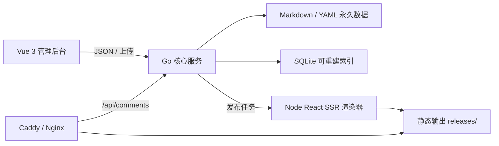

# MutiBlog 技术架构

## 1. 架构决定

MutiBlog 采用“一个常驻 Go 服务 + 一个按需 Node 渲染器 + 一个容器”的结构。



### 1.1 常驻 Go 服务

负责：

- 初始化、单管理员认证、会话和 CSRF；
- 文件仓库的读写、锁、校验和原子替换；
- 内容、媒体、评论、主题、备份和翻译任务 API；
- SQLite 索引、外部文件变化检测与重建；
- 任务调度、事件日志和健康检查；
- 提供嵌入式管理后台静态资源；
- 调用按需渲染器并原子切换公开版本。

选择 Go 的原因是单二进制、低常驻内存、文件和并发任务控制成熟。

### 1.2 Vue 3 管理后台

负责 Halo 风格控制台。技术基线：

- Vue 3 + TypeScript + Vite；
- Vue Router + Pinia + TanStack Vue Query；
- `@halo-dev/components`（MIT）作为公共 UI 原语；
- CodeMirror 6 作为 Markdown 编辑器；
- `vue-i18n` 加载后台语言包。

后台不持有永久真相，只通过 API 工作；离线草稿可以存在浏览器本地缓存，但保存后必须写入文件仓库。

### 1.3 Node React SSR 渲染器

Node 不是常驻 Web 服务。Go 在发布、预览和主题安装校验时启动渲染 CLI：

```text
mutiblog-render --input <snapshot.json> --theme <dir> --output <staging-dir>
```

渲染器负责：

- 加载受支持版本的主题 manifest 与服务端 bundle；
- React SSR；
- Markdown 渲染与代码高亮；
- 生成多语言页面、回退跳转、搜索索引、RSS、sitemap 与 robots；
- 产出构建报告和内容哈希。

渲染进程设有超时、内存限制、输出目录边界和结构校验。第一版主题视为受信任的管理员安装代码，不宣称安全沙箱。

## 2. 运行目录

默认工作目录为 `/var/lib/mutiblog`，可用 `MUTIBLOG_DATA_DIR` 覆盖。

```text
/var/lib/mutiblog/
├── config/
│   ├── site.yaml
│   ├── locales.yaml
│   ├── admin.yaml
│   └── secrets.yaml          # 0600，备份排除
├── content/
│   ├── posts/
│   ├── pages/
│   ├── taxonomies/
│   ├── menus/
│   ├── links/
│   └── dictionaries/
├── comments/
├── media/
│   ├── originals/
│   └── metadata/
├── themes/
│   ├── installed/
│   └── settings/
├── revisions/
├── state/
│   ├── index.sqlite          # 可删除
│   ├── tasks/
│   └── audit/
├── generated/                # 可删除
│   ├── staging/
│   ├── previews/
│   └── releases/
└── backups/
```

`content`、`comments`、`media/originals`、非秘密 `config`、主题包与设置、`revisions` 是永久数据。`state/index.sqlite` 与整个 `generated` 可安全删除并重建。

## 3. 写入与一致性

每次永久写入遵循：

1. 在同目录创建临时文件；
2. 写入并 `fsync`；
3. 校验 YAML/Markdown schema；
4. 原子 `rename` 替换目标；
5. `fsync` 父目录；
6. 更新 SQLite 投影；
7. 投影失败时记录重建标记，永久文件仍为权威。

同一实体使用进程内 keyed mutex；所有修改带 `revision`/ETag，过期客户端写入返回 `409`。外部文件修改由 watcher 和启动时全量扫描发现。

## 4. 发布协议

发布采用不可变 release 与原子指针：

1. 冻结一个文件快照并计算内容哈希；
2. 渲染到 `generated/staging/<job-id>`；
3. 运行链接、语言、资源与 HTML 检查；
4. 移到 `generated/releases/<release-id>`；
5. 原子更新 `generated/current` 符号链接；
6. 保留最近若干 release 供快速回滚。

反向代理直接读取 `generated/current`。动态服务宕机不会影响已经存在的静态 release。

## 5. 安全边界

- 密码使用 Argon2id；会话 token 随机生成，仅保存哈希；Cookie 为 HttpOnly、SameSite=Lax，HTTPS 下 Secure。
- 变更请求校验 Origin 与 CSRF token。
- 上传按 MIME、扩展名、大小和解码结果校验，文件名不参与磁盘路径。
- ZIP 安装拒绝绝对路径、`..`、符号链接逃逸和解压炸弹。
- API Key 仅存 `config/secrets.yaml`，目录 0700、文件 0600；API 和日志始终遮罩。
- 备份使用白名单选取，不以黑名单排除秘密。
- 渲染器只能写入任务 staging 目录，并限制执行时间和输出体积。

## 6. 可观测与恢复

- `/health/live`：进程存活；
- `/health/ready`：永久目录可读写、索引可用；
- `/api/v1/system/status`：发布、索引、翻译、主题任务摘要；
- 结构化 JSON 日志，敏感字段统一脱敏；
- 每个后台任务写入可恢复的 YAML 任务记录；
- 启动时清理孤儿 staging、恢复可重试任务、扫描文件与索引差异。

## 7. 不采用的方案

- 不以 SQLite 作为永久数据源；
- 不在请求公开文章时读取 Markdown 动态渲染；
- 不要求 Redis、PostgreSQL、队列或搜索集群；
- 不常驻独立 Node Web 服务；
- 不运行 Halo Thymeleaf 主题；
- 不实现 Halo 插件运行时或多用户权限系统。
